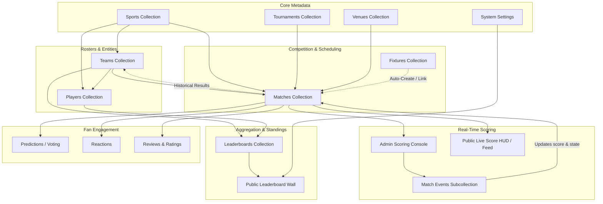

# Comprehensive Architectural & System Audit Report: Olympia 2K26

**Project:** Olympia 2K26 Sports Scoring Platform  
**Target Environment:** React 19 + TypeScript + Vite + Tailwind CSS + Firebase (Auth, Firestore, Cloud Functions, Storage, Hosting)  
**Date of Audit:** October 1, 2026  
**Auditor:** Antigravity Agentic AI System  
**Scope:** Complete Codebase Inspection (Frontend, Backend/Firebase, Firestore Collections, Auth, Admin Flow, Match Creation, Live Scoring, Leaderboard, Predictions, Reactions, Telemetry, Listeners, Security Rules, Routing, Concurrency, and System Dependencies).  
**Status:** Audit Only — No code modified.

---

## Executive Summary

Olympia 2K26 is an ambitious multi-sport tournament management and live scoring platform designed for college sports festivals covering 11 disciplines (Football, Cricket, Volleyball, Hand Tennis, LAN Games, Badminton, Table Tennis, Chess, Carrom, Counter-Strike, Smash Karts).

While the application features world-class UI choreography (Framer Motion, velocity marquees, custom cursor, sound FX, high-contrast dark/day themes, broadcast scoring pads), our deep architectural inspection reveals **critical discrepancies across data layers**:
1. **Severe Inconsistencies in Collection Paths**: Client services, hooks, Cloud Functions, Admin manager screens, and Firestore Security Rules are writing to and reading from completely different collection paths for Voting, Reactions, Reviews, and Ratings.
2. **Disconnected Client Interactions**: Public UI widgets on `MatchDetail` (`VotingPanel`, `ReactionBar`, `MatchStats`) operate purely in local React `useState` or render hardcoded demo statistics, completely detached from Firestore.
3. **Data Loss Vulnerability in Match Editor**: Editing match metadata on an existing match overwrites live scoring and resets match status to `scheduled` with `0-0` score.
4. **Security Rules Blind Spots**: `firebase/firestore.rules` omits rules for subcollections (`matches/{id}/events`), `leaderboards`, and `settings`, which would cause immediate `permission-denied` errors in production if deployed.
5. **Race Condition in Concurrency**: Event recording uses non-transactional `getDoc` + `addDoc` sequence increments instead of Firestore `runTransaction`, exposing the system to duplicate sequence numbers during simultaneous operator scoring.
6. **Hardcoded Fallbacks**: Multiple production views (`ArenaLeaderboardPreview`, `Results`, `ScoringConsole` ticker, `PlayerDetail`, `TeamDetail`) fall back to hardcoded fictitious entities from legacy seeds.

Below is the exhaustive 20-point audit and dependency graph.

---

## 1. Current Firestore Schema

The Firestore database consists of root collections and subcollections across the application:

| Collection Path | Scope | Document ID Scheme | Schema / Primary Fields | Consumer Services / Components |
|---|---|---|---|---|
| `sports/{sportId}` | Root | `cricket`, `football`, `volleyball`, etc. | `id, name, slug, icon, description, active, category, scoringType, teamBased, maxPlayersPerTeam, minPlayersPerTeam` | `sportService.ts`, `SportsManager.tsx`, `SportDetail.tsx`, `Leaderboard.tsx` |
| `tournaments/{tournamentId}` | Root | `olympia-championship-2k26` | `id, name, season, status, startDate, endDate, sportId` | `tournamentService.ts`, `TournamentsManager.tsx`, `FixtureEditor.tsx` |
| `venues/{venueId}` | Root | `main-arena`, `sports-complex`, etc. | `id, name, capacity, active, location, description` | `venueService.ts`, `VenuesManager.tsx`, `MatchEditor.tsx` |
| `teams/{teamId}` | Root | Deterministic: `team-{sportId}-{teamSlug}` (24 teams) | `id, name, shortName, sportId, captainId, captainName, logo, playerIds: string[], wins, losses, draws, points, active, coach, description` | `teamService.ts`, `TeamsManager.tsx`, `TeamDetail.tsx`, `Leaderboard.tsx` |
| `players/{playerId}` | Root | Deterministic: `player-{sportId}-{playerSlug}` (216 athletes) | `id, name, teamId, sportId, role, position, photo, jerseyNumber, gender, active, bio, stats: {...}` | `playerService.ts`, `PlayersManager.tsx`, `PlayerDetail.tsx`, `Leaderboard.tsx` |
| `matches/{matchId}` | Root | `match-{sportId}-{number}` | `id, sportId, tournamentId, matchNumber, teamAId, teamBId, participantA: {...}, participantB: {...}, venueId, scheduledAt, startedAt, pausedAt, endedAt, status, score, liveState, displayMode, featured, featuredPriority, allowReactions, allowVoting, allowRatings, allowReviews, archived, round, lastSequence, isHidden, createdBy, createdAt, updatedAt` | `matchService.ts`, `scoringService.ts`, `ScoringConsole.tsx`, `Live.tsx`, `MatchDetail.tsx`, `Matches.tsx` |
| `matches/{matchId}/events/{eventId}` | Subcollection | Auto-generated Firestore ID | `id, sequence, matchId, sportId, type, timestamp, matchTime, team, teamName, playerId, playerName, description, positioning, positioningText, data, snapshot: {score, liveState}, undone, undoneAt, undoneBy, isCorrection, correctionNote, replacesSequence, createdBy` | `scoringService.ts`, `ScoringConsole.tsx`, `MatchDetail.tsx`, `MatchTimeline.tsx` |
| `fixtures/{fixtureId}` | Root | Auto-generated or `fixture-{sportId}-{num}` | `id, tournamentId, sportId, matchId, teamAId, teamBId, scheduledAt, venueId, status, order, round, isHidden, createdAt` | `fixtureService.ts`, `FixturesManager.tsx`, `FixtureEditor.tsx`, `Matches.tsx`, `SportDetail.tsx` |
| `admins/{uid}` | Root | User UID (e.g. Firebase Auth UID) | `uid, email, displayName, role: 'super_admin' \| 'admin' \| 'score_operator' \| 'content_manager', active, permissions: string[], createdAt, updatedAt` | `adminService.ts`, `AdminsManager.tsx`, `AdminEditor.tsx`, `AuthContext.tsx` |
| `auditLogs/{auditId}` | Root | Auto-generated Firestore ID | `id, action, targetType, targetId, user: {uid, email, displayName, role}, timestamp, details: Record<string, any>` | `auditService.ts`, `AuditLogPage.tsx`, `useAuditLog.ts` |
| `settings/default` | Root Singleton | `default` | `id, festivalName, edition, year, theme, defaultDisplayMode, publicLeaderboardVisible, publicFixturesVisible, allowPredictions, allowReactions, allowReviews, allowRatings, contactEmail, socialLinks, updatedAt, updatedBy` | `settingsService.ts`, `SettingsPage.tsx`, `Leaderboard.tsx`, `Matches.tsx` |
| `leaderboards/{sportId}` | Root | `sportId` (e.g. `cricket`, `football`) | `id, sportId, sportName, category: 'team' \| 'individual', isHidden, entries: LeaderboardEntry[], updatedAt` | `LeaderboardsManager.tsx`, `Leaderboard.tsx` |
| `votes/{voteId}` | Root (Legacy / Admin) | Auto-generated | `matchId, selectedTeam, userId, createdAt` | `VotesManager.tsx` (Read only) |
| `match_voting/{matchId}` | Root (Hook) | `matchId` | `{ [teamId]: number, [option]: number }` | `useVoting.ts` |
| `matches/{matchId}/votes/{uid}` | Subcollection (Service) | User UID | `{ teamId, updatedAt }` | `votingService.ts` |
| `reactions/{reactionId}` | Root (Legacy / Admin) | Auto-generated | `matchId, type, userId, timestamp` | `ReactionsManager.tsx` (Read only) |
| `match_reactions/{matchId}` | Root (Hook) | `matchId` | `{ [reactionType]: number }` | `useReactions.ts` |
| `matches/{matchId}/reactions/{uid}` | Subcollection (Service) | User UID | `{ type, updatedAt }` | `reactionService.ts` |
| `reviews/{reviewId}` | Root (Hook / Admin) | Auto-generated | `matchId, userId, content, rating, hidden, status, createdAt, updatedAt` | `useReviews.ts`, `ReviewsManager.tsx` |
| `matches/{matchId}/reviews/{uid}` | Subcollection (Service) | User UID | `{ content, rating, updatedAt }` | `reviewService.ts` |
| `ratings/{ratingId}` | Root (Admin) | Auto-generated | `matchId, playerId, userId, rating, createdAt` | `RatingsManager.tsx` (Read only) |
| `matches/{matchId}/players/{playerId}/ratings/{uid}` | Subcollection (Service) | User UID | `{ score, updatedAt }` | `ratingService.ts` |

---

## 2. Current Match Data Structure

Defined in `src/types/match.ts`:

```typescript
export type MatchStatus = 'scheduled' | 'upcoming' | 'live' | 'paused' | 'completed' | 'cancelled';
export type DisplayMode = 'dual_portrait' | 'single_landscape';

export interface Participant {
  id: string;
  name: string;
  logo: string;
  type: 'team' | 'player';
}

export interface MatchScore {
  teamA: number;
  teamB: number;
  details: Record<string, unknown>; // e.g., cricket overs/wickets, set scores, half time scores
}

export interface LiveState {
  period?: number;
  clock?: string;
  half?: number;
  set?: number;
  rally?: number;
  game?: number;
  innings?: number;
  over?: number;
  ball?: number;
  wickets?: number;
  extras?: number;
  map?: number;
  round?: number;
}

export interface Match {
  id: string;
  sportId: string;
  tournamentId: string;
  matchNumber: number;
  teamAId: string;
  teamBId: string;
  participantA: Participant;
  participantB: Participant;
  venueId: string;
  scheduledAt: Timestamp;
  startedAt: Timestamp | null;
  pausedAt: Timestamp | null;
  endedAt: Timestamp | null;
  status: MatchStatus;
  score: MatchScore;
  liveState: LiveState;
  displayMode: DisplayMode;
  featured: boolean;
  featuredPriority: number;
  allowReactions: boolean;
  allowVoting: boolean;
  allowRatings: boolean;
  allowReviews: boolean;
  archived: boolean;
  round?: string;
  lastSequence?: number; // Monotonic event sequence counter (#1, #2...)
  isHidden?: boolean;    // Admin visibility toggle
  createdBy: string;
  createdAt: Timestamp;
  updatedAt: Timestamp;
}
```

---

## 3. Current Event / Timeline Implementation

Defined in `src/types/matchEvent.ts` and managed in `src/services/scoring/scoringService.ts`:

- **Path:** `matches/${matchId}/events/${eventId}`
- **Data Model:**
  ```typescript
  export interface MatchEvent {
    id: string;
    sequence: number;           // Monotonic integer (#1, #2, #3, ...)
    matchId: string;
    sportId: string;
    type: EventType;            // 'goal', 'six', 'four', 'wicket', 'point', etc.
    timestamp: Timestamp;
    matchTime?: string;
    team?: 'teamA' | 'teamB' | '';
    teamName?: string;
    playerId?: string;
    playerName?: string;
    description: string;
    positioning?: SportPositioning; // { innings, over, ball, period, matchSecond, set, rally, game, round }
    positioningText?: string;       // Formatted: "[Ov 2.3 · Inn 1]", "[1H 24']", "[Set 2 · Rally 37]"
    snapshot?: {
      score: Record<string, unknown>;
      liveState: Record<string, unknown>;
    };
    undone: boolean;            // True when undone by operator
    undoneAt?: Timestamp;
    undoneBy?: string;
    isCorrection?: boolean;     // True when created via operator event correction
    correctionNote?: string;
    replacesSequence?: number;
    createdBy: string;
  }
  ```
- **Timeline Rendering:**
  - `MatchTimeline.tsx` renders chronological items ordered by `sequence` descending or ascending.
  - Undone events (`undone === true`) are automatically filtered out from public displays.
  - Corrections are styled with amber highlight badges and audit note pills.

---

## 4. Current Admin Scoring Flow

Operates primarily in `src/pages/AdminDashboard/ScoringConsole.tsx`:
1. **Entry**: Admin visits `/admin/matches/:matchId/scoring`.
2. **Subscriptions**:
   - `onSnapshot(doc(db, 'matches', matchId))` listens to the match document.
   - `subscribeToMatchEvents(matchId, callback)` listens to subcollection `matches/${matchId}/events` ordered by `sequence desc`.
3. **Status Transitions**:
   - Start Match: Triggers countdown overlay, updates match status to `'live'`, writes `startedAt: serverTimestamp()`.
   - Pause / Resume: Sets status to `'paused'` / `'live'`, writes `pausedAt`.
   - End Match: Fires final whistle celebration, locks status to `'completed'`, writes `endedAt`.
4. **Action Dispatch**:
   - Operator clicks sport pad (e.g. "+1 Run", "FOUR", "SIX", "+10 RUNS BONUS", "GOAL", "+1 POINT").
   - Triggers `recordMatchEvent`:
     1. Reads `matchData.lastSequence`.
     2. Calculates `nextSequence = lastSequence + 1`.
     3. Adds event document to `matches/${matchId}/events`.
     4. Updates `matches/${matchId}` with `{ score, liveState, lastSequence, updatedAt }`.
     5. Plays audio / visual animation (`ScoreFXLayer`, screen shake, trajectory arc).
5. **Undo Workflow**:
   - Operator clicks `[↩ Undo Last Action]`.
   - `undoLastActiveEvent` finds latest active event in Firestore, sets `undone: true`, rolls match `score` and `liveState` back to prior event's snapshot.
6. **Correction Workflow**:
   - Operator clicks `[✏️ Correct]` on timeline card.
   - Enters delta adjustment and mandatory audit note.
   - `correctMatchEvent` marks original event as undone and appends a correction event (`isCorrection: true`).

---

## 5. Current Authentication and Authorization

Implementation: `src/contexts/AuthContext.tsx` and `src/components/admin/ProtectedRoute.tsx`.
- **Firebase Auth**: Supports Email/Password (`signInWithEmailAndPassword`) and Anonymous (`signInAnonymously`).
- **Authorization Flow**:
  1. `onAuthStateChanged` listens to Firebase user.
  2. For non-anonymous users, `getIdTokenResult(user, true)` is forced to verify the custom claim: `token.claims.admin === true`.
  3. Firestore profile check: `getDoc(doc(db, 'admins', user.uid))` is checked to ensure `active !== false`.
  4. In `ProtectedRoute.tsx`:
     ```typescript
     const isAuthorized = !!user && !user.isAnonymous && isAdmin === true && (!admin || admin.active !== false);
     ```
     If false, redirects to `/admin/login`.
- **Public Users**: Unauthenticated or anonymous users can view public routes (`/`, `/live`, `/matches`, `/sports`, `/teams`, `/players`, `/leaderboard`, `/results`).

---

## 6. Current Firestore Security Rules

Located in `firebase/firestore.rules`:

```javascript
rules_version = '2';
service cloud.firestore {
  match /databases/{database}/documents {
    function isAdmin() {
      return request.auth != null && (
        request.auth.token.admin == true ||
        exists(/databases/$(database)/documents/admins/$(request.auth.uid))
      );
    }
    function isAuthenticated() { return request.auth != null; }

    match /admins/{adminId} { allow read: if isAuthenticated(); allow write: if isAdmin(); }
    match /auditLogs/{auditId} { allow read: if isAdmin(); allow create: if isAuthenticated(); allow update, delete: if isAdmin(); }

    // Public read, admin write
    match /sports/{sportId} { allow read: if true; allow write: if isAdmin(); }
    match /tournaments/{tournamentId} { allow read: if true; allow write: if isAdmin(); }
    match /venues/{venueId} { allow read: if true; allow write: if isAdmin(); }
    match /announcements/{announcementId} { allow read: if true; allow write: if isAdmin(); }
    match /teams/{teamId} { allow read: if true; allow write: if isAdmin(); }
    match /players/{playerId} { allow read: if true; allow write: if isAdmin(); }
    match /matches/{matchId} { allow read: if true; allow write: if isAdmin(); }
    match /matchEvents/{eventId} { allow read: if true; allow write: if isAdmin(); }
    match /fixtures/{fixtureId} { allow read: if true; allow write: if isAdmin(); }
    match /displayConfigs/{configId} { allow read: if true; allow write: if isAdmin(); }

    // Interactions
    match /reactions/{reactionId} { allow read: if true; allow create: if isAuthenticated() && request.resource.data.userId == request.auth.uid; allow update, delete: if isAdmin(); }
    match /ratings/{ratingId} { allow read: if true; allow create, update: if isAuthenticated() && request.resource.data.userId == request.auth.uid && request.resource.data.rating >= 1 && request.resource.data.rating <= 5; allow delete: if isAdmin(); }
    match /reviews/{reviewId} { allow read: if true; allow create, update: if isAuthenticated() && request.resource.data.userId == request.auth.uid && request.resource.data.text.size() <= 1000; allow delete: if isAdmin() || (isAuthenticated() && resource.data.userId == request.auth.uid); }
    match /votes/{voteId} { allow read: if true; allow create, update: if isAuthenticated() && request.resource.data.userId == request.auth.uid; allow delete: if isAdmin(); }

    match /match_voting/{matchId} { allow read: if true; allow write: if isAuthenticated() || isAdmin(); }
    match /match_reactions/{matchId} { allow read: if true; allow write: if isAuthenticated() || isAdmin(); }
    match /users/{userId} { allow read, write: if isAuthenticated() && request.auth.uid == userId; }
  }
}
```

### Critical Security Rule Deficiencies:
1. **Subcollection Omission**: `match /matches/{matchId}` does NOT match `matches/{matchId}/events/{eventId}`! Subcollections in Firestore rules require explicit recursive wildcards (`match /matches/{matchId}/{document=**}`) or explicit subcollection matches.
2. **Missing `leaderboards` Collection**: `leaderboards/{sportId}` has no rule block. In production, writes and reads to `leaderboards` will be denied.
3. **Missing `settings` Collection**: `settings/{settingId}` has no rule block. Writes by admin to `settings/default` will be denied.
4. **Root `matchEvents` vs Subcollection**: Line 58 specifies `match /matchEvents/{eventId}` which is dead code since all events are stored under `matches/{matchId}/events`.

---

## 7. Which Data Is Hardcoded

The audit identified the following hardcoded datasets embedded in the code:

1. **`src/components/arena/ArenaLeaderboardPreview.tsx` (Lines 28–85)**:
   - Contains `DEFAULT_SPORTS_PREVIEWS` with fictitious teams (`Thunderbolts FC`, `Phoenix United`, `Storm Breakers XI`, `Golden Warriors`, `Spike Masters`, `Block Titans`, `Cyber Phantoms`) and fake athletes (`Arjun Mehta`, `Rahul Dravid Jr`, `Akash Reddy`, `CyberX`).
   - The component ignores live data and directly renders this hardcoded array!
2. **`src/components/matches/MatchStats.tsx` (Lines 13–18)**:
   - Contains hardcoded football telemetry:
     `{ label: 'Possession', valA: 55, valB: 45 }, { label: 'Shots', valA: 12, valB: 8 }, { label: 'Shots on Target', valA: 5, valB: 3 }, { label: 'Fouls', valA: 10, valB: 14 }`.
   - Rendered on every match regardless of discipline (Cricket, Badminton, Chess, etc.).
3. **`src/pages/AdminDashboard/ScoringConsole.tsx` (Lines 218–223)**:
   - Standings ticker scorer list is hardcoded:
     `[ { id: 'p1', name: 'A. Vega' }, { id: 'p2', name: 'R. Okoye' }, { id: 'p3', name: 'M. Silva' }, { id: 'p4', name: 'K. Ito' } ]`.
4. **`src/pages/Results/Results.tsx` (Lines 23–28)**:
   - `fallbackCompletedMatches` with fictitious matches (`Alex Rivers vs Marcus Vance`, `Golden Hawks vs Thunderbolts`, etc.).
5. **`src/pages/Players/PlayerDetail.tsx` (Lines 20–45)**:
   - Hardcoded `fallbackPlayer` (`Marcus Vance`, #23, Basketball).
6. **`src/pages/Teams/TeamDetail.tsx` (Lines 21–31)**:
   - Hardcoded fallback team (`Thunderbolts`, Basketball).
7. **`src/pages/Sports/SportDetail.tsx` (Lines 11–18)**:
   - Hardcoded fallback sports map (`defaultSports`).
8. **Brand Logos in `BrandAssets.ts`**:
   - Hardcoded static PNG/JPG/SVG paths mapped to public asset folders.

---

## 8. Which Data Is Actually Real-Time

Data that automatically reflects across clients without manual page refresh via active `onSnapshot` listeners:

1. **Live Matches**:
   - `matches` collection where `status == 'live'` is listened to by `LiveMatchContext.tsx`, `LiveScoreHUD.tsx`, `LiveNowSection.tsx`, and `Live.tsx`. Any score or clock change in Firestore re-renders instantly.
2. **Current Match & Timeline Events in Scoring Console**:
   - `ScoringConsole.tsx` subscribes directly to `matches/${matchId}` and `matches/${matchId}/events`. Score updates, event adds, and undo rollbacks update live.
3. **Public Match Detail**:
   - `MatchDetail.tsx` (via `useMatch.ts`) listens to `matches/${matchId}` and `matches/${matchId}/events` via `onSnapshot`.
4. **System Settings**:
   - `settings/default` is subscribed to via `useDoc('settings', 'default')` in `Leaderboard.tsx`, `Matches.tsx`, `SportDetail.tsx`. Changing master visibility updates public walls in real time.
5. **Audit Logs**:
   - `AuditLogPage.tsx` listens via `subscribeToAudit` to `auditLogs` collection ordered by `timestamp desc`.
6. **All Admin Management Lists**:
   - Any screen using `useCollection` (`MatchesManager`, `TeamsManager`, `PlayersManager`, `FixturesManager`, `LeaderboardsManager`) updates in real time when any admin modifies records.

---

## 9. Which Components Currently Write to Firestore

| File / Component | Target Firestore Path | Operation | Payload / Purpose |
|---|---|---|---|
| `scoringService.ts` / `ScoringConsole.tsx` | `matches/${matchId}/events` | `addDoc` | Records sequential scoring action with snapshot |
| `scoringService.ts` / `ScoringConsole.tsx` | `matches/${matchId}` | `updateDoc` | Updates `score`, `liveState`, `status`, `lastSequence` |
| `scoringService.ts` (undo) | `matches/${matchId}/events/${eventId}` | `updateDoc` | Sets `undone: true`, `undoneAt`, `undoneBy` |
| `FixtureEditor.tsx` | `fixtures` | `addDoc` / `updateDoc` | Saves scheduled fixture |
| `FixtureEditor.tsx` | `matches` | `addDoc` / `updateDoc` | Auto-creates or syncs linked match document |
| `MatchEditor.tsx` | `matches` | `addDoc` / `updateDoc` | Creates / updates match (resets score!) |
| `MatchesManager.tsx` | `matches/${id}` | `updateDoc`, `deleteDoc` | Bulk visibility, status cancellation, delete |
| `FixturesManager.tsx` | `fixtures/${id}` | `updateDoc`, `deleteDoc` | Bulk visibility, reordering |
| `TeamEditor.tsx` | `teams` | `addDoc` / `updateDoc` | Creates / updates team profile and roster |
| `PlayerEditor.tsx` | `players` | `addDoc` / `updateDoc` | Creates / updates player profile |
| `LeaderboardsManager.tsx` | `leaderboards/${sportId}` | `setDoc`, `deleteDoc` | Publishes sport standings snapshot; sets visibility |
| `SettingsPage.tsx` | `settings/default` | `setDoc` (merge) | Updates system festival settings |
| `AdminEditor.tsx` | `admins/${uid}` | `setDoc` / `updateDoc` | Updates admin profile and active status |
| `auditService.ts` (via `useAuditLog`) | `auditLogs` | `addDoc` | Logs admin mutation events |
| `useVoting.ts` | `match_voting/${matchId}` | `setDoc` (merge) | Increments vote counter (hook only) |
| `useReactions.ts` | `match_reactions/${matchId}` | `setDoc` (merge) | Increments reaction counter (hook only) |
| `useReviews.ts` | `reviews` | `addDoc` | Adds review document (hook only) |
| `votingService.ts` | `matches/${id}/votes/${uid}` | `setDoc` | Casts user vote (service only) |
| `reactionService.ts` | `matches/${id}/reactions/${uid}` | `setDoc` | Stores user reaction (service only) |
| `reviewService.ts` | `matches/${id}/reviews/${uid}` | `setDoc` | Stores user review (service only) |
| `ratingService.ts` | `matches/${id}/players/${pId}/ratings/${uid}` | `setDoc` | Stores player rating (service only) |

---

## 10. Which Components Listen with `onSnapshot`

Every component utilizing `useCollection` or `useDoc` opens a persistent `onSnapshot` stream.

### Frontend Public Surfaces:
- `App.tsx` (via `LiveMatchContext`): `matches` (where `status == 'live'`)
- `Home.tsx`: `sports`, `matches`, `teams`, `players`
- `Live.tsx`: `matches`, `teams`
- `Matches.tsx`: `matches`, `fixtures`, `sports`, `tournaments`, `teams`, `settings/default`
- `MatchDetail.tsx` (via `useMatch`): `matches/${matchId}`, `matches/${matchId}/events`
- `SportDetail.tsx`: `sports`, `matches`, `fixtures`, `tournaments`, `venues`, `teams`, `settings/default`
- `Teams.tsx` / `TeamDetail.tsx`: `teams`, `players`, `matches`, `sports`
- `Players.tsx` / `PlayerDetail.tsx`: `players`, `teams`, `sports`
- `Leaderboard.tsx`: `players`, `teams`, `sports`, `leaderboards`, `settings/default`
- `Results.tsx`: `matches`, `sports`
- `FeaturedMatch.tsx`: `matches`, `teams`
- `LiveNowSection.tsx`: `matches`, `teams`
- `LiveScoreHUD.tsx`: `matches`, `teams`
- `UpcomingMatches.tsx`: `matches`, `teams`
- `MobileBottomNav.tsx`: `matches`

### Admin Dashboard Surfaces:
- `AdminDashboard.tsx`: `matches`, `teams`, `players`, `votes`, `reviews`, `reactions`, `fixtures`, `matchEvents`, `auditLogs`
- `ScoringConsole.tsx`: `matches/${matchId}`, `matches/${matchId}/events`, `sports`, `teams`
- `MatchesManager.tsx`: `matches`, `sports`, `tournaments`, `venues`, `teams`, `settings/default`
- `FixturesManager.tsx`: `fixtures`, `sports`, `tournaments`, `venues`, `teams`, `matches`, `settings/default`
- `LeaderboardsManager.tsx`: `leaderboards`, `sports`, `teams`, `players`, `settings/default`
- `TeamsManager.tsx`: `teams`, `sports`, `players`
- `PlayersManager.tsx`: `players`, `teams`, `sports`
- `AuditLogPage.tsx`: `auditLogs` (via `subscribeToAudit`)
- `SettingsPage.tsx`: `settings/default`
- `VotesManager.tsx`: `votes`, `matches`, `teams`
- `ReactionsManager.tsx`: `reactions`, `matches`, `sports`
- `ReviewsManager.tsx`: `reviews`, `matches`
- `RatingsManager.tsx`: `ratings`, `matches`, `players`

---

## 11. Current Leaderboard Calculation

Implemented across `src/pages/Leaderboard/` and `src/pages/AdminDashboard/LeaderboardsManager.tsx`:

1. **Data Source Priority**:
   - `Leaderboard.tsx` checks if an explicit snapshot document exists in `leaderboards/${sportId}` and is not hidden (`isHidden !== true`).
   - If present: Uses `customLeaderboardDoc.entries` published from admin.
   - If absent: Falls back to live `teams` collection (for team sports) or `players` collection (for individual sports).
2. **Sorting Logic**:
   - **Team Sports** (`football`, `cricket`, `volleyball`, `hand-tennis`, `lan-games`):
     Sorted by `points` descending:
     `sortedTeams = [...teams].sort((a, b) => (b.points || 0) - (a.points || 0));`
   - **Individual Sports** (`badminton`, `table-tennis`, `chess`, `carrom`):
     Sorted by `stats.points` or `stats.wins` descending.
3. **Disconnection from Match Outcomes**:
   - **Crucial Finding:** Completed matches do NOT automatically update team `points`, `wins`, `losses`, or player statistics in Firestore.
   - Points are static numbers stored on the `teams` document.
   - To update standings, an admin must manually edit teams in `TeamsManager` or click "Sync / publish" in `LeaderboardsManager`.

---

## 12. Current Prediction / Voting Implementation

The audit discovered **four separate, mutually incompatible implementations**:

| Layer | File | Read Target | Write Target | Active in UI? |
|---|---|---|---|---|
| **Public UI Component** | `src/components/voting/VotingPanel.tsx` | Local `useState` (`{ A: 0, B: 0 }`) | Local `useState` | **YES** (on `MatchDetail`) — but writes to nothing |
| **Hook** | `src/hooks/useVoting.ts` | `match_voting/${matchId}` | `match_voting/${matchId}` (`increment(1)`) | **NO** (Not imported on `MatchDetail`) |
| **Service** | `src/services/voting/votingService.ts` | `matches/${matchId}/aggregates/votes` | `matches/${matchId}/votes/${uid}` | **NO** (Not wired to `VotingPanel`) |
| **Admin Manager** | `src/pages/AdminDashboard/VotesManager.tsx` | Root `votes` collection | `matches/${id}.votingStatus` | **YES** (Admin screen) — but reads empty root collection |
| **Cloud Function** | `functions/src/voting/validateVote.ts` | Trigger: `votes/{voteId}` | `matches/${matchId}.votesCount` | Staged in functions, but not deployed/invoked |

**Result:** A user voting on `MatchDetail` sees an animation that vanishes on refresh; the vote never reaches Firestore; the admin `VotesManager` displays 0 ballots.

---

## 13. Current Reaction Implementation

Similarly, reactions suffer from **four conflicting implementations**:

| Layer | File | Read Target | Write Target | Active in UI? |
|---|---|---|---|---|
| **Public UI Component** | `src/components/reactions/ReactionBar.tsx` | Local `useState` (all 0) | Local `useState` (floating animation) | **YES** (on `MatchDetail`) — but writes to nothing |
| **Hook** | `src/hooks/useReactions.ts` | `match_reactions/${matchId}` | `match_reactions/${matchId}` (`increment(1)`) | **NO** (Not imported on `MatchDetail`) |
| **Service** | `src/services/reactions/reactionService.ts` | `matches/${matchId}/aggregates/reactions` | `matches/${matchId}/reactions/${uid}` | **NO** (Not wired to `ReactionBar`) |
| **Admin Manager** | `src/pages/AdminDashboard/ReactionsManager.tsx` | Root `reactions` collection | `matches/${id}.allowReactions` | **YES** (Admin screen) — reads empty root collection |
| **Cloud Function** | `functions/src/reactions/aggregateReactions.ts` | Trigger: `reactions/{reactionId}` | `matches/${matchId}.reactionCounts` | Staged in functions, not deployed |

**Result:** Clicking emoji reactions on `MatchDetail` updates local state only. The admin `ReactionsManager` shows 0 total reactions.

---

## 14. Current Telemetry Implementation

Telemetry exists at two layers:

1. **Scoring Event Telemetry**:
   - `scoringService.ts` packages sport-specific positioning into `MatchEvent.positioning`:
     - Cricket: `{ innings: 1, over: 2, ball: 3 }` -> formatted to `[Ov 2.3 · Inn 1]`
     - Football: `{ period: 1, matchSecond: 1432 }` -> formatted to `[1H 24']`
     - Volleyball: `{ set: 2, rally: 37 }` -> formatted to `[Set 2 · Rally 37]`
     - LAN / CS: `{ map: 1, round: 12 }` -> formatted to `[Map 1 · Round 12]`
   - Each event carries a full `snapshot: { score, liveState }`.
2. **Administrative Audit Telemetry**:
   - `src/services/audit/auditService.ts` exports `logAudit` and `subscribeToAudit`.
   - Every mutation in Admin (creating/editing matches, fixtures, teams, players, settings) calls `log(action, targetType, targetId, details)`.
   - Writes directly to root `auditLogs` collection with authenticated admin UID, email, and server timestamp.
   - Displayed live in `AuditLogPage.tsx` and the recent activity feed in `AdminDashboard.tsx`.
3. **Missing / Mocked Telemetry**:
   - `src/components/matches/MatchStats.tsx` renders hardcoded football possession/shots percentages without reading any telemetry from Firestore.

---

## 15. Current Match Lifecycle / Status Handling

1. **Lifecycle States**:
   - `scheduled` -> Match exists, date set in future, score `0-0`.
   - `upcoming` -> Match is next in queue.
   - `live` -> Match actively in progress, clock ticking, scoring pads enabled.
   - `paused` -> Match temporarily halted (e.g. half-time, rain delay, tactical timeout).
   - `completed` -> Match ended, final score locked.
   - `cancelled` -> Match abandoned.
2. **Transition Triggers**:
   - `ScoringConsole.tsx`:
     - Clicking "Start Match" transitions `scheduled` -> `live`.
     - Clicking "Pause" transitions `live` -> `paused`.
     - Clicking "Resume" transitions `paused` -> `live`.
     - Clicking "End Match" transitions `live` -> `completed`.
   - `MatchesManager.tsx`:
     - Admin can manually cancel matches (`status: 'cancelled'`).
   - `FixtureEditor.tsx`:
     - Creating a fixture with `autoCreateMatch: true` creates a match with initial status `scheduled`.

---

## 16. Duplicate & Conflicting Sources of Truth

| Entity | Source of Truth A | Source of Truth B | Discrepancy & Impact |
|---|---|---|---|
| **Match Score** | `match.score` on `matches/{id}` | Cumulative delta of `matches/{id}/events` | If an operator manually edits `match.score` in Firestore, the event timeline will disagree with the scoreboard. |
| **Team Rosters** | `team.playerIds: string[]` on `teams/{id}` | `player.teamId: string` on `players/{id}` | Bi-directional reference. In the rogue import bug, `team.playerIds` had rogue IDs while `players` had canonical IDs. |
| **Match Clock** | Client `setInterval` in `ScoringConsole.tsx` | `match.startedAt` / `liveState.clock` | Refreshing the browser resets the operator's clock to `00:00` even if the match has been running for 45 minutes. |
| **Fixtures vs Matches** | `fixtures` collection | `matches` collection | Standings/fixture views synthesize fake match objects if a fixture has no linked match, causing ID collisions (`fixture.id` vs `match.id`). |
| **Leaderboard Standings** | `teams.points` | `leaderboards/{sportId}.entries` | If an admin updates `teams.points` in `TeamsManager`, the change is NOT reflected in `leaderboards` until a manual sync is run. |
| **User Votes** | `match_voting/{matchId}` (hook) | `matches/{id}/votes` (service) vs `votes` (admin) | Four isolated stores with zero cross-sync. |
| **User Reactions** | `match_reactions/{matchId}` (hook) | `matches/{id}/reactions` (service) vs `reactions` (admin) | Four isolated stores with zero cross-sync. |

---

## 17. Race-Condition & Multi-Admin Concurrency Problems

1. **Non-Transactional Sequence Generation in `recordMatchEvent`**:
   - In `src/services/scoring/scoringService.ts`:
     ```typescript
     const matchSnap = await getDoc(matchRef);
     const currentSequence = Number(matchData?.lastSequence || 0);
     const nextSequence = currentSequence + 1;
     ...
     await addDoc(eventsCollRef, { sequence: nextSequence, ... });
     await updateDoc(matchRef, { lastSequence: nextSequence, ... });
     ```
   - **Problem:** If two operators or two devices score within the same second, both read `currentSequence = 42`, both create an event with `sequence: 43`, and the last `updateDoc` overwrites the other.
   - **Fix Required:** Must use Firestore `runTransaction` to atomically increment `lastSequence` and guarantee monotonic ordering.
2. **Simultaneous Undo Collisions**:
   - `undoLastActiveEvent` queries the collection and updates the latest active event. If two admins click undo simultaneously, both could mark the same event as undone or roll back to inconsistent states.
3. **Scoreboard Overwrite via `MatchEditor`**:
   - If an admin edits a match's venue or date in `MatchEditor.tsx` while another admin is scoring live, `MatchEditor` will write `score: { teamA: 0, teamB: 0 }` and `status: 'scheduled'`, obliterating the live score.

---

## 18. Fake / Demo Data Still Present

The following files still contain fake or demo data:
1. `src/components/arena/ArenaLeaderboardPreview.tsx`: `DEFAULT_SPORTS_PREVIEWS` (fictitious teams `Thunderbolts FC`, `Phoenix United`, `Storm Breakers XI`, etc.).
2. `src/components/matches/MatchStats.tsx`: `defaultStats` (hardcoded football stats).
3. `src/pages/Results/Results.tsx`: `fallbackCompletedMatches` (fictitious matches).
4. `src/pages/Players/PlayerDetail.tsx`: `fallbackPlayer` (`Marcus Vance`).
5. `src/pages/Teams/TeamDetail.tsx`: fallback team (`Thunderbolts`).
6. `src/pages/AdminDashboard/ScoringConsole.tsx`: `scorers` state (`A. Vega`, `R. Okoye`, etc.).
7. `src/data/demoDataProvider.ts`: Unused demo seed provider.

---

## 19. Security Vulnerabilities

1. **Firestore Rules Missing Subcollections**:
   - Cloud Firestore rules in `firebase/firestore.rules` do not cover `matches/{id}/events/{eventId}`. If security rules are deployed as-is, all client event logging will fail with `permission-denied`.
2. **Missing Rule Blocks for `leaderboards` and `settings`**:
   - Any client reading or writing to `leaderboards` or `settings` would be blocked under default deny rules.
3. **Client-Side Voting without Auth or Uniqueness**:
   - `useVoting.ts` allows any user to increment vote counters via `setDoc` with `increment(1)` without verifying single-vote-per-user on the server.
4. **Rate-Limiting in Client Only**:
   - `useReactions.ts` implements rate-limiting in a client-side `useRef`, which can be completely bypassed by any script firing writes directly to Firestore.
5. **Admin Client-Side Claim Check**:
   - While `AuthContext.tsx` verifies custom claims on token refresh, client-side route guards (`ProtectedRoute.tsx`) can be bypassed in DevTools; Firestore database security rules are the ONLY real protection, so they must strictly enforce `request.auth.token.admin == true`.

---

## 20. Functionality Visually Present but Not Actually Functional

1. **Match Detail Predictions**:
   - User votes in `VotingPanel.tsx` change the percentage bar in local memory only. Refreshing resets the poll; votes are never persisted to Firestore.
2. **Match Detail Reactions**:
   - Emojis floating from `ReactionBar.tsx` animate on screen but never save to Firestore.
3. **Match Detail Telemetry**:
   - `MatchStats.tsx` displays possession and shots sliders, but these are static constants completely unrelated to the match.
4. **Ratings and Reviews**:
   - `RatingsManager` and `ReviewsManager` exist in Admin, but there is no rating or review form rendered on the public `MatchDetail` page (`ReviewSection.tsx` and `PlayerRatingCard.tsx` are orphaned).
5. **Admin Dashboard Recent Events**:
   - `AdminDashboard.tsx` listens to `matchEvents` root collection (which has 0 documents), leaving the recent events table blank.
6. **NRR & Points Integration in Simulator**:
   - `ScoringSimulator.tsx` calculates Net Run Rate and football bonus formulas in a sandbox, but these custom formulas are not connected to the real `ScoringConsole.tsx` or `Leaderboard.tsx`.
7. **Featured Matches Query**:
   - `matchService.getFeaturedMatches` queries `where('isFeatured', '==', true)` while documents in Firestore use the property `featured: boolean`.

---

## System Dependency Graph & Matrix

Understanding which systems depend on which is critical before planning architectural changes:



### Dependency Hierarchy:

1. **Level 0 (Foundational Metadata)**:
   - `sports`, `tournaments`, `venues`, `settings`
   - *Dependencies:* None. Must exist before any teams, players, or matches can be created.
2. **Level 1 (Participant Rosters)**:
   - `teams`, `players`
   - *Dependencies:* Depends on `sports`. Players depend on `teams` (`teamId`).
3. **Level 2 (Competition Schedule)**:
   - `fixtures`, `matches`
   - *Dependencies:* Depends on `sports`, `tournaments`, `venues`, and `teams`/`players`.
4. **Level 3 (Real-Time Scoring & Event Sourcing)**:
   - `matches/${id}/events`, `ScoringConsole`, `LiveNowSection`, `LiveScoreHUD`
   - *Dependencies:* Depends on `matches`. Matches depends on `events` for score rollbacks and timeline history.
5. **Level 4 (Standings & Leaderboard)**:
   - `leaderboards/${sportId}`, `Leaderboard.tsx`
   - *Dependencies:* Depends on `teams`, `players`, `settings/default`, and completed `matches`.
6. **Level 5 (Fan Interactions & Engagement)**:
   - Voting, Reactions, Reviews, Ratings
   - *Dependencies:* Depends on `matches/${id}` and Firebase Auth `userId`.

---

## Summary of Audit Findings & Recommendations

| Category | Severity | Summary | Required Direction (When Ready) |
|---|---|---|---|
| **Security Rules** | 🔴 HIGH | Subcollections, `leaderboards`, and `settings` missing in `firestore.rules`. | Add explicit security rule blocks for `matches/{id}/events`, `leaderboards`, and `settings`. |
| **Match Editor** | 🔴 HIGH | `MatchEditor.tsx` resets live scores and status to `scheduled` upon edit. | Preserve existing `score`, `status`, and `liveState` when updating an existing match. |
| **Concurrency** | 🟠 MEDIUM | `recordMatchEvent` increments sequence without a Firestore transaction. | Wrap event creation and match update in `runTransaction`. |
| **Engagement Disconnect** | 🟠 MEDIUM | Voting, reactions, reviews, ratings have 4 conflicting storage paths. | Standardize on one canonical path per interaction across services, hooks, and admin managers. |
| **Hardcoded Fallbacks** | 🟡 LOW | `ArenaLeaderboardPreview`, `MatchStats`, `Results` show fake demo data. | Wire components to live Firestore collections and remove dummy constants. |
| **Match Clock** | 🟡 LOW | Scoring console clock is local `setInterval`. | Synchronize timer with Firestore `startedAt` / `liveState.clock`. |

---
*End of Audit Report. No code changes have been executed.*
